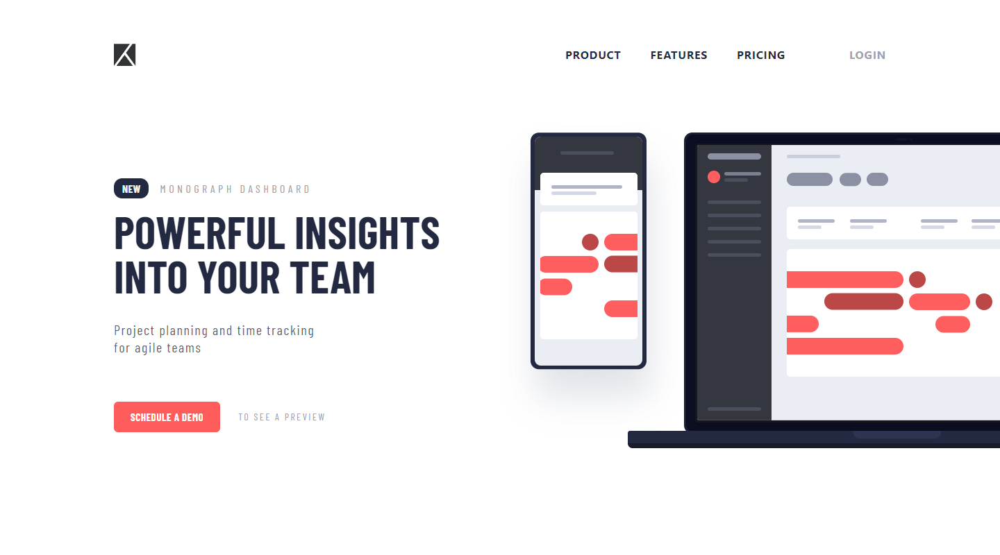

# Frontend Mentor - Project tracking intro component solution

This is a solution to the [Project tracking intro component challenge on Frontend Mentor](https://www.frontendmentor.io/challenges/project-tracking-intro-component-5d289097500fcb331a67d80e). Frontend Mentor challenges help you improve your coding skills by building realistic projects.

## Table of contents

- [Frontend Mentor - Project tracking intro component solution](#frontend-mentor---project-tracking-intro-component-solution)
  - [Table of contents](#table-of-contents)
  - [Overview](#overview)
    - [The challenge](#the-challenge)
    - [Screenshot](#screenshot)
    - [Links](#links)
    - [Built with](#built-with)
  - [Author](#author)

## Overview

### The challenge

Users should be able to:

- View the optimal layout for the site depending on their device's screen size
- See hover states for all interactive elements on the page
- Create the background shape using code

### Screenshot

### Links

- Live Site URL: [live site URL ](https://64777ea03a8ddb0078a829d2--luxury-kelpie-01142f.netlify.app/)
- Github URL: [Git](https://github.com/Sittisukintaruk/Project-tracking-intro-component)

### Built with

- Semantic HTML5 markup
- CSS custom properties
- Flexbox
- CSS Grid
- Mobile-first workflow
- Tailwind
- vite
- dom

## Author

- Frontend Mentor - [@Sitthisak Intharak](https://www.frontendmentor.io/profile/Sittisukintaruk)
